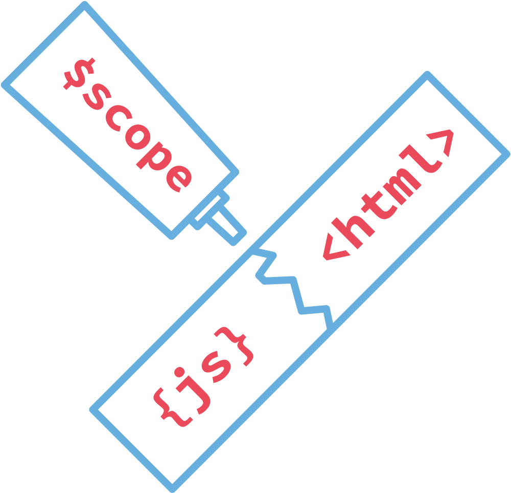

# AngularJS

---


### AngularJS is what HTML would have been, had it been designed for applications

#### *Miško Hevery*

---

*Client* side *single page* MVC framework in *JavaScript*

---

### What makes AngularJS so powerful?

---

# Two way data binding
- Possibility to change the *model* bidirectional
- HTML template –> *model* <– JS

---

HTML

``` html
                <input ng-model="name">
                <div>{{name}}</div>
```

---

app.js

``` js
                $scope.name = 'François';
```

---
Resulting HTML


``` html
                  <div>François</div>
```

---

# Directives

*Components* to teach the browser
 interpretation of *new HTML tags*

---


# Build in directives like

*ng-repeat*, *ng-if*, *ng-bind*, *ng-hide*


---

HTML

```html
                <shopping-list
                    list="['baguette', 'fromage']">
                </shopping-list>
```

---

shopping-list-directive.js

```js
        module.directive('shoppingList', function () {

            return {
                templateUrl: 'shopping-list.html'
            };

        });
```

---

shopping-list.html


```html
            <ul>
                <li ng-repeat="item in list">
                    {{item}}
                </li>
            </ul>
```

---

Resulting HTML

```html
                <ul>
                    <li>baguette</li>
                    <li>fromage</li>
                </ul>
```

---




---

# Scope 1/3

Exposes domain model to view (template)

---


# Scope 2/3

AngularJS *observes* events (eg. input)
and applies changes to the *scope*

---

# Scope 3/3

Scope hierarchy *reflects* DOM hierarchy

---

# And so much more…
- Dependency Injection
- Strong Testability
- Views and Routes
- Animations
- Services

---

by *Sebastian Fröstl* | Small Improvements
